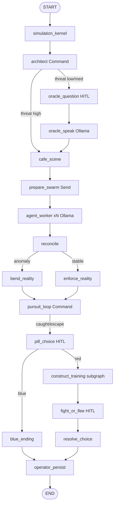

# The Matrix

Cinematic multi-agent LangGraph simulation of the control plane from *The Matrix*,
with **real local dialogue via Ollama**.

| Movie idea | LangGraph analogue |
|---|---|
| Simulation kernel | Shared state + reducers + world locations |
| Agents (Smith / Jones / Brown) | Send API swarm + Ollama personas + tools |
| Architect / Oracle | Command API supervisor + HITL question + Ollama |
| Humans jacked in | Fresh thread ids + multi-HITL interrupts |
| “There is no spoon” | Conditional edges rewrite `physics_rules` |
| Pursuit | Command self-loop until escape / caught |
| Construct | Nested subgraph (load → spar → score) |
| Operator outside | Redis checkpoints + session lives + resume CLI |

## Flow



## Setup

Needs **Redis** (`localhost:6379`) and **Ollama**.

```bash
# Ollama
ollama serve
ollama pull llama3.2

# Project
cd ~/Documents/matrix
uv sync --extra dev
```

Optional env:

| Variable | Default |
|---|---|
| `OLLAMA_BASE_URL` | `http://localhost:11434` |
| `OLLAMA_MODEL` | `llama3.2` |
| `MATRIX_THREAT_SKIP_ORACLE` | `7` |
| `MATRIX_PURSUIT_MAX_ROUNDS` | `3` |

## Run (story mode)

Each jack-in uses a **fresh** Redis thread (no piled-up Agent reports).
There are **up to 3 pauses** — resume each one from a separate process.

```bash
# 1) Jack in — usually pauses at Oracle question
uv run matrix-jack-in

# 2) Answer the Oracle (free text)
uv run matrix-resume "Am I the One?"

# 3) After cafe / swarm / pursuit — choose the pill
uv run matrix-resume red
# or: uv run matrix-resume blue

# 4) If red — Construct training then fight/flee
uv run matrix-resume fight
# or: uv run matrix-resume flee

# Inspect Redis
uv run matrix-redis
```

If you resume a finished thread, you get `ALREADY FINISHED` (pill choice is one-shot per jack-in).

### Knobs (`start_driver.py`)

- `threat_level >= 7` — skip Oracle HITL, go straight to cafe
- `anomaly` — `"spoon"` | `"glitch"` | `"none"`

## Tests

```bash
# Mocked LLM — no Ollama required
uv run pytest -q

# Optional live Ollama smoke
MATRIX_OLLAMA_SMOKE=1 uv run pytest -q -m ollama
```
