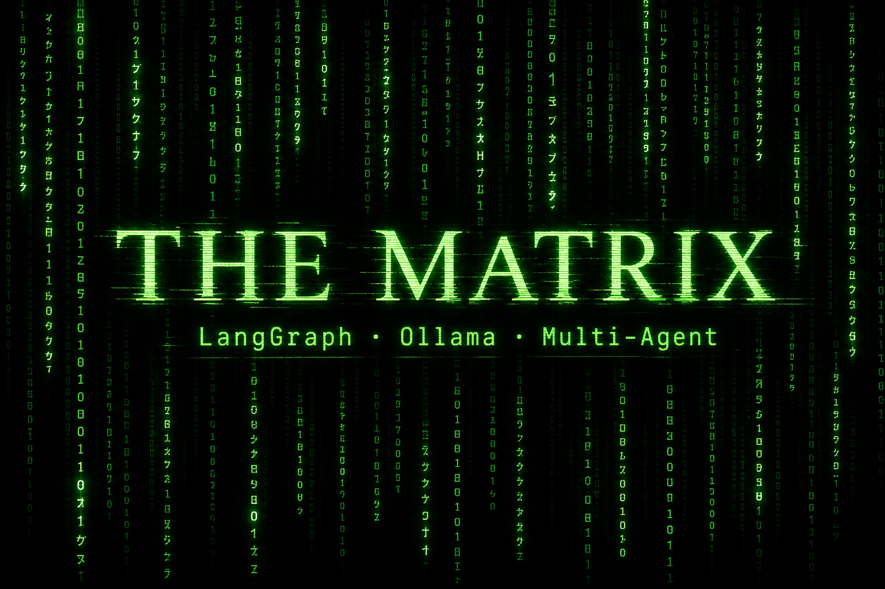

# The Matrix

<p align="center">
  
</p>

Cinematic **LangGraph** multi-agent simulation of *The Matrix*: shared world state,
**rank-scaled open-source Ollama brains** (one model per character), **independent
agent decisions**, cross-cycle **learning memory** in Redis, interactive HITL
jack-in, and a **continuous background daemon** that never stops until you stop it.

> Terminal output uses **Matrix green on black** (`src/matrix/theme.py`).  
> Disable with `MATRIX_NO_COLOR=1` or `NO_COLOR=1`.

| Piece | Role |
|---|---|
| LangGraph | Multi-act control plane, Command routing, Send swarm, interrupts |
| Ollama | Local LLMs — each cast member has its own brain |
| Redis | Checkpointing (resume) + `SessionMemory` (lives + agent learning) |
| Daemon | Infinite reincarnation: cycle → learning pulse → next cycle |

Package: `the-matrix` · Python ≥ 3.11 · entry points via `uv run …`

---

## Table of contents

1. [Prerequisites](#1-prerequisites)
2. [Install](#2-install)
3. [Start required services](#3-start-required-services)
4. [Pull character brains](#4-pull-character-brains)
5. [Hardware notes (M1 32GB)](#5-hardware-notes-m1-32gb)
6. [Environment variables](#6-environment-variables)
7. [CLI reference](#7-cli-reference)
8. [Execution path A — interactive jack-in](#8-execution-path-a--interactive-jack-in)
9. [Execution path B — continuous daemon](#9-execution-path-b--continuous-daemon)
10. [What happens during one cycle](#10-what-happens-during-one-cycle)
11. [Multi-agent learning & independent action](#11-multi-agent-learning--independent-action)
12. [Rank → brain ladder](#12-rank--brain-ladder)
13. [Possible outcomes](#13-possible-outcomes)
14. [Project layout](#14-project-layout)
15. [Tests](#15-tests)
16. [Troubleshooting](#16-troubleshooting)

---

## 1. Prerequisites

| Dependency | Why | Check |
|---|---|---|
| **Python 3.11+** | Runtime | `python3 --version` |
| **[uv](https://docs.astral.sh/uv/)** | Install + run scripts | `uv --version` |
| **[Ollama](https://ollama.com)** | Local LLM inference | `ollama --version` |
| **Redis** | LangGraph checkpointer + session / agent memory | `redis-cli ping` → `PONG` |

Optional: enough disk for models (full ladder including 14B/32B can be **tens of GB**).

---

## 2. Install

```bash
cd /path/to/matrix
uv sync                 # runtime deps
uv sync --extra dev     # + pytest
```

This installs console scripts into the project venv:

| Command | Purpose |
|---|---|
| `matrix-jack-in` | Start an interactive life (pauses at HITLs) |
| `matrix-resume` | Resume the active thread with a choice |
| `matrix-daemon` | Continuous auto-play + learning |
| `matrix-pull-brains` | `ollama pull` every character model |
| `matrix-redis` | Inspect Redis keys used by the sim |

Always prefer `uv run <command>` so the venv is used.

---

## 3. Start required services

Open **two** terminals (or run Redis/Ollama as background services).

### 3.1 Ollama

```bash
ollama serve
# default API: http://localhost:11434
```

### 3.2 Redis

```bash
# macOS (Homebrew)
brew services start redis
# or
redis-server

# verify
redis-cli ping
```

The app expects:

- Redis at `localhost:6379` (`redis://localhost:6379`)
- Ollama at `http://localhost:11434` (override with `OLLAMA_BASE_URL`)

Without Redis, graph compile / invoke fails (checkpointer). Without Ollama,
character speech raises `OllamaUnavailableError` with pull hints.

---

## 4. Pull character brains

```bash
uv run matrix-pull-brains
```

Prints the rank ladder, then runs `ollama pull <model>` for each unique tag.
First run is slow; later runs are incremental.

**Partial pull (manual)** if you only want a light M1 set:

```bash
ollama pull tinyllama
ollama pull gemma2:2b
ollama pull phi3:mini
ollama pull qwen2.5:3b
ollama pull llama3.2
ollama pull mistral
ollama pull llama3.1
ollama pull qwen2.5:7b
# skip gemma2:9b / qwen2.5:14b / qwen2.5:32b and override those brains (below)
```

Missing models: the code **falls back** to `OLLAMA_MODEL` (default `llama3.2`)
for that character so a run can continue.

---

## 5. Hardware notes (M1 32GB)

| Tier | Models | On M1 32GB |
|---|---|---|
| Comfortable | ≤7–8B | Fine |
| Tight | `gemma2:9b`, `qwen2.5:14b` | One-at-a-time OK; slow swaps |
| Risky | `qwen2.5:32b` (Architect) | Often swap / OOM with OS + Redis + Python |

Ollama loads **one** model per call; a full cycle switches brains often (load cost).

**Recommended M1 overrides** (keep rank order, cap the top):

```bash
export MATRIX_BRAIN_SMITH=qwen2.5:7b
export MATRIX_BRAIN_ORACLE=qwen2.5:7b
export MATRIX_BRAIN_ARCHITECT=qwen2.5:7b   # or qwen2.5:14b if stable
```

Put these in your shell profile or prefix every `uv run` command.

---

## 6. Environment variables

### LLM / world

| Variable | Default | Meaning |
|---|---|---|
| `OLLAMA_BASE_URL` | `http://localhost:11434` | Ollama HTTP API |
| `OLLAMA_MODEL` | `llama3.2` | Fallback brain if a character model fails / missing |
| `MATRIX_NO_COLOR` / `NO_COLOR` | unset | Set to `1` to disable green-on-black ANSI in the terminal |
| `MATRIX_THREAT_SKIP_ORACLE` | `7` | Threat ≥ this → Architect forced to cafe (skip Oracle HITL) |
| `MATRIX_PURSUIT_MAX_ROUNDS` | `7` | Smith chase rounds before forced escape |
| `MATRIX_SHOWDOWN_MAX_ROUNDS` | `3` | Subway showdown rounds |

### Per-character brains

`MATRIX_BRAIN_<NAME>` where `<NAME>` is uppercased character id:

| Env | Character |
|---|---|
| `MATRIX_BRAIN_SPOON_BOY` | Spoon Boy |
| `MATRIX_BRAIN_JONES` | Agent Jones |
| `MATRIX_BRAIN_BROWN` | Agent Brown |
| `MATRIX_BRAIN_TANK` | Tank |
| `MATRIX_BRAIN_CYPHER` | Cypher |
| `MATRIX_BRAIN_OPERATOR` | Daemon Operator (HITL chooser) |
| `MATRIX_BRAIN_TRINITY` | Trinity |
| `MATRIX_BRAIN_MORPHEUS` | Morpheus |
| `MATRIX_BRAIN_NEO` | Neo |
| `MATRIX_BRAIN_SMITH` | Agent Smith |
| `MATRIX_BRAIN_ORACLE` | Oracle |
| `MATRIX_BRAIN_ARCHITECT` | Architect |

Example one-liner:

```bash
MATRIX_BRAIN_ARCHITECT=qwen2.5:7b MATRIX_BRAIN_ORACLE=qwen2.5:7b \
  uv run matrix-daemon start --foreground
```

---

## 7. CLI reference

### `matrix-jack-in`

```bash
uv run matrix-jack-in
```

1. Creates a **fresh** `thread_id` → writes `.active_thread`
2. Invokes the compiled graph with Redis checkpointer
3. Runs cinematic nodes until the **first HITL interrupt**
4. Prints pause instructions (kind + hint)
5. Exits; state is durable in Redis under that thread

### `matrix-resume <choice>`

```bash
uv run matrix-resume extract
uv run matrix-resume trust
uv run matrix-resume "Am I the One?"
uv run matrix-resume red
uv run matrix-resume refuse
uv run matrix-resume jump
uv run matrix-resume fight
uv run matrix-resume call
uv run matrix-resume accept
```

- Reads `.active_thread`
- Resumes with `Command(resume=…)`
- Stops again at the next interrupt, or prints the **ending** if the life finished

If you pass nothing, defaults apply (e.g. bug→`extract`, pill→`red`, fight→`flee`).

If the thread already finished: prints `ALREADY FINISHED` — jack in again.

### `matrix-daemon`

```bash
uv run matrix-daemon start                 # background, infinite
uv run matrix-daemon start --foreground    # same loop, attached to terminal
uv run matrix-daemon start --interval 30   # pause 30s between lives
uv run matrix-daemon start --cycles 1      # finite demo (not continuous)
uv run matrix-daemon status
uv run matrix-daemon stop
```

| Flag | Default | Meaning |
|---|---|---|
| `--cycles` | `0` | `0` = **infinite**; `N` = stop after N lives |
| `--interval` | `0` | Seconds to wait between lives (`0` = immediate next life) |
| `--foreground` | off | Run worker in this terminal (writes PID file) |

Files:

| File | Purpose |
|---|---|
| `.matrix_daemon.pid` | Background worker PID |
| `.matrix_daemon.log` | UTC timestamped cycle / Operator / learning logs |
| `.active_thread` | Last jack-in thread (interactive or daemon) |

### `matrix-pull-brains`

```bash
uv run matrix-pull-brains
```

### `matrix-redis`

```bash
uv run matrix-redis
```

Inspect Redis keys used by checkpoints / sessions (operator-side tooling).

---

## 8. Execution path A — interactive jack-in

Use this when **you** want to pick pills and choices.

### Full red-path example (Operator sequence)

```bash
# terminals: ollama serve + redis already up
uv sync
uv run matrix-pull-brains   # once

uv run matrix-jack-in
uv run matrix-resume extract          # bug
uv run matrix-resume trust            # trust Trinity
uv run matrix-resume "Am I the One?"  # oracle free text (if Architect consults)
uv run matrix-resume red              # pill
uv run matrix-resume refuse           # steak
uv run matrix-resume jump             # jump program
uv run matrix-resume fight            # fight Smith
uv run matrix-resume call             # radio
uv run matrix-resume accept           # code vision
# → ending printed; life persisted to Redis SessionMemory
```

Notes:

- Architect may **skip** the Oracle interrupt when threat is high (`≥ MATRIX_THREAT_SKIP_ORACLE`).
- Blue pill: after `matrix-resume blue`, Acts III–V are skipped; you go to epilogue/persist.
- Each `jack-in` is a **new** thread (reducer lists stay clean). Prior **learning** still loads from Redis `agent_knowledge`.

### Typical wall-clock

Depends on model sizes and how many Ollama swaps occur. Light 7B-capped brains:
minutes per full red path. Heavy 14B/32B: much longer.

---

## 9. Execution path B — continuous daemon

Use this so acts **do not stop**: agents keep living, learning, and deciding.

### Recommended continuous run

```bash
ollama serve                                          # terminal 1
redis-server                                          # or brew services
cd /path/to/matrix
uv sync

# optional M1 caps
export MATRIX_BRAIN_SMITH=qwen2.5:7b
export MATRIX_BRAIN_ORACLE=qwen2.5:7b
export MATRIX_BRAIN_ARCHITECT=qwen2.5:7b

uv run matrix-pull-brains
uv run matrix-daemon start                            # background forever
uv run matrix-daemon status                           # tail-ish of log
# …
uv run matrix-daemon stop                             # graceful after current cycle
```

Watch live:

```bash
uv run matrix-daemon start --foreground
# Ctrl+C or another terminal: uv run matrix-daemon stop
```

### Daemon loop (what “continuous” means)

```
┌─────────────────────────────────────────────────────────┐
│  forever (until stop / SIGTERM)                         │
│    1. Fresh thread_id + jack-in                         │
│    2. Auto-resume every HITL via Operator LLM brain     │
│    3. CYCLE END → outcome / awakened / memory size      │
│    4. LEARNING PULSE — Neo, Trinity, Morpheus, Smith,   │
│       Oracle, Architect, Tank, Cypher, Jones, Brown     │
│       each independently: reflect|adapt|ally|oppose|    │
│       prepare + LEARN fact about peers                  │
│    5. Persist facts → Redis SessionMemory.agent_knowledge│
│    6. Next cycle immediately (or after --interval)      │
└─────────────────────────────────────────────────────────┘
```

Log markers to look for:

```
DAEMON START continuous=INFINITE
CYCLE START thread=matrix-neo-…
OPERATOR brain chose kind=pill → red
CYCLE END outcome=… memory=…
LEARNING PULSE — cast decides independently for next life…
LEARNING PULSE done facts=…
CONTINUOUS — starting next cycle immediately
```

**Do not** use `--cycles 1` if you want continuous learning — that is a one-shot demo only.

---

## 10. What happens during one cycle

### Act map

| Act | Beats | Notes |
|---|---|---|
| **0** | Jack-in → white rabbit → office → interrogation → **bug HITL** | Refuse implants bug then continues |
| **I** | Dream glitch → meet Trinity → **trust HITL** → briefing / doubt | Then Architect |
| **II** | Architect (may skip Oracle) → **oracle HITL** → cafe → Agent **swarm** (Send) → bend/enforce reality → lobby → **pursuit loop** → **pill HITL** | Blue → ending shortcut |
| **III** | Ship awaken → farm → dinner → **steak HITL** → sentinel → **Construct** subgraph → **jump HITL** | Training score rises |
| **IV** | Trinity warn → **fight/flee HITL** → combat → **radio HITL** → subway showdown loop → hardline | Showdown `won` / `escaped` |
| **V** | **code HITL** → Zion → **resolve outcome** → epilogue → Operator persist | Redis life + agent knowledge |

### Construct subgraph

`load_skills → spar_morpheus → spar_agent_sim → score_training`

### LangGraph patterns used

| Pattern | Where |
|---|---|
| Shared `MatrixState` + reducers | dialogue, events, log, agent_reports, agent_memory, … |
| `Command(goto=…)` | Architect, pill, pursuit, showdown, bug/trust/steak |
| `Send` fan-out | Agent Smith / Jones / Brown workers |
| `interrupt()` HITL | Nine Operator decision kinds |
| Nested graph | Construct training |
| Redis checkpointer | Pause / resume / daemon auto-resume |

---

## 11. Multi-agent learning & independent action

### During a scene

1. Character gets an **awareness dossier** (other dialogue, reports, actions, Oracle/Architect echoes, Redis-carried memory).
2. `character_act` asks their brain to reply:

   ```
   ACTION: <allowed option>
   SAY: <in-character line>
   LEARN: <fact about another agent>
   ```

3. Patches append to `character_actions` and `agent_memory` (reducers).

Independent action examples:

| Scene | Actor | Example actions |
|---|---|---|
| Swarm | Jones / Brown / Smith | `scan`, `hunt`, `contain`, `observe` |
| Pursuit | Smith | `close_in`, `cut_off`, `intimidate`, `hold` (biases chase odds) |
| Architect | Architect | `consult_oracle`, `deploy_cafe` |
| Cafe | Spoon Boy / Neo | `teach`/`hint`/`silence` · `believe`/`doubt`/`question` |
| Lobby | Trinity / Smith / Neo | combat / suppress / dodge choices |

### Between cycles (daemon learning pulse)

After persist, `learning_pulse` runs the main cast again with stances
`reflect | adapt | ally | oppose | prepare`. Facts are merged into
`SessionMemory.agent_knowledge` (capped ~200). Next `simulation_kernel`
reloads that list into `agent_memory` so brains **remember peers across lives**.

---

## 12. Rank → brain ladder

Higher Matrix rank → larger default open-source Ollama model.

| Rank | Character | Default model | ~Size |
|---:|---|---|---|
| 1 | Spoon Boy | `tinyllama` | 1.1B |
| 2 | Jones | `gemma2:2b` | 2B |
| 3 | Brown | `gemma2:2b` | 2B |
| 4 | Tank | `phi3:mini` | 3.8B |
| 5 | Cypher | `qwen2.5:3b` | 3B |
| 6 | Operator | `llama3.2` | 3B |
| 7 | Trinity | `mistral` | 7B |
| 8 | Morpheus | `llama3.1` | 8B |
| 9 | Neo | `qwen2.5:7b` | 7B |
| 10 | Smith | `gemma2:9b` | 9B |
| 11 | Oracle | `qwen2.5:14b` | 14B |
| 12 | Architect | `qwen2.5:32b` | 32B |

Defined in `src/matrix/characters.py` (`RANK`, `RANK_BRAINS`).

---

## 13. Possible outcomes

Every finished cycle writes terminal `outcome` + `awakened` via `blue_ending`
or `resolve_choice`.

### Terminal endings (`outcome`)

| Ending | When | `awakened` | Summary |
|---|---|---:|---|
| **Blue pill** | `pill_choice=blue` | no | Wakes in bed; believes what they want to believe. |
| **The One begins** | red + `fight` + `training_score≥8` + `code=accept` | yes | Full path + sees the code. |
| **Beginning of belief** | red + `fight` + `training_score≥6` (not full One bar) | yes | Fights Smith; belief starts. |
| **Rescued by Trinity** | red + `fight` + `training_score<6` | yes | Undertrained; nearly loses. |
| **Lives to fight another cycle** | red + `flee` | yes | Hardline escape; another cycle. |
| **Desert of the real** | red + no fight/flee recorded | yes | Unplugged fallback. |

Blue-pill runs skip Acts III–V after `blue_ending`.

### HITL choices

| Kind | Options | Effect |
|---|---|---|
| `bug` | `extract` \| `refuse` | Extract → dream; refuse → bug implanted then dream |
| `trust` | `trust` \| `walk` | Trust → briefing; walk → early doubt |
| `oracle_question` | free text | Oracle answers before cafe |
| `pill` | `red` \| `blue` | **Main branch** |
| `steak` | `steak` \| `refuse` | Steak → Cypher regret; refuse → sentinel |
| `jump` | `jump` \| `hesitate` | Training / narrative into combat |
| `fight_or_flee` | `fight` \| `flee` | **Major** ending driver |
| `radio` | `call` \| `silent` | Noted in red-path outcome |
| `code` | `accept` \| `deny` | Accept +3 score + `code_sight` |

Invalid answers fall back (pill→`blue`, fight→`flee`, code→`accept`, …).

### Non-HITL statuses

| Field | Values | Source |
|---|---|---|
| `pursuit_status` | `chasing` → `escaped` \| `caught` | Pursuit loop / max rounds |
| `showdown_status` | `won` \| `escaped` | Score ≥6 when showdown ends → `won` |
| `reality_rewritten` | bool | Swarm reconcile → bend vs enforce |
| Architect route | Oracle vs cafe | LLM act + threat floor |

### Example “The One” recipe

```
bug=extract → trust=trust → pill=red → steak=refuse → jump=jump
→ fight=fight → radio=call → code=accept
(+ construct training_score ≥ 8, showdown won)
```

→ outcome contains *“sees the code — The One begins.”* · `awakened=true`

---

## 14. Project layout

```
matrix/
├── pyproject.toml
├── README.md
├── docs/
│   └── matrix-banner.png   # repo banner (green code rain)
├── .active_thread          # last thread id (runtime)
├── .matrix_daemon.pid      # daemon PID (runtime)
├── .matrix_daemon.log      # daemon log (runtime)
├── src/matrix/
│   ├── graphs/main.py      # full multi-act graph
│   ├── graphs/construct.py # training subgraph
│   ├── nodes/              # scene nodes (act0…finale)
│   ├── characters.py       # personas, RANK, brains
│   ├── theme.py            # green-on-black terminal theme
│   ├── awareness.py        # dossiers, parse_decision, aware_node
│   ├── continuous.py       # between-cycle learning pulse
│   ├── llm.py              # Ollama speak / character_act / operator_choose
│   ├── daemon.py           # continuous worker CLI
│   ├── start_driver.py     # matrix-jack-in
│   ├── resume_driver.py    # matrix-resume
│   ├── state.py / models.py
│   ├── services/memory.py  # Redis checkpointer + SessionMemory
│   └── services/redis_client.py
└── tests/                  # mocked Ollama unit tests
```

---

## 15. Tests

No Ollama/Redis required for the default suite (LLM calls mocked):

```bash
uv run pytest -q
```

Optional live Ollama tests are marked `@pytest.mark.ollama` and skipped unless you run them deliberately against a local server.

---

## 16. Troubleshooting

| Symptom | Likely cause | Fix |
|---|---|---|
| Checkpointer / connection errors | Redis down | `redis-cli ping`; start Redis |
| `OllamaUnavailableError` | Ollama down or model missing | `ollama serve`; `ollama pull <tag>`; or `matrix-pull-brains` |
| Daemon exits after one life | You passed `--cycles 1` | `matrix-daemon start` with no `--cycles` |
| `Daemon already running` | Stale PID or real process | `matrix-daemon stop`; delete `.matrix_daemon.pid` if stale |
| `ALREADY FINISHED` on resume | Thread completed | `matrix-jack-in` for a new life |
| M1 thrashing / freeze | 14B/32B brains | Cap with `MATRIX_BRAIN_ORACLE` / `_ARCHITECT` / `_SMITH` → `qwen2.5:7b` |
| Very slow cycle | Many model swaps | Fewer distinct tags via env overrides; smaller models |
| No learning across lives | Redis wiped / wrong host | Confirm `localhost:6379`; inspect with `matrix-redis` |
| No green terminal colors | Piped output / `NO_COLOR` | Run in a real TTY; unset `MATRIX_NO_COLOR` / `NO_COLOR` |

### Quick health check

```bash
redis-cli ping
curl -s http://localhost:11434/api/tags | head
uv run pytest -q
uv run matrix-daemon status
```

---

## Quick start (copy-paste)

```bash
# 1) services
ollama serve &
brew services start redis   # or redis-server

# 2) project
cd /path/to/matrix
uv sync
export MATRIX_BRAIN_SMITH=qwen2.5:7b
export MATRIX_BRAIN_ORACLE=qwen2.5:7b
export MATRIX_BRAIN_ARCHITECT=qwen2.5:7b
uv run matrix-pull-brains

# 3a) continuous agents (recommended)
uv run matrix-daemon start
uv run matrix-daemon status
# stop later: uv run matrix-daemon stop

# 3b) OR interactive
uv run matrix-jack-in
uv run matrix-resume extract
# … continue HITLs …
```
